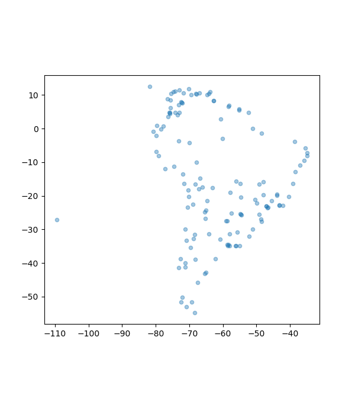

# Lotniska Ameryki Południowej
## Krótki opis projektu
Projekt powstał jako zaliczenie laboratiorów podstawy programowania. Polega na analizie i wizualizacji danych dotyczących lotnisk z całego świata. Dane zostały odpowiednio wyczyszczone tak, aby zawierały jednynie lotniska dla Ameryki Południowej. Używając **geopandas**, ramka danych została zmieniona na georamkę danych w celu nadania geometrii i wizualizacji. Dodatkowo, używając **pętli for** wydzielono lotniska, które posiadały liczbę miejsc większą niż 1 milion oraz stworzono wykres przedstawiający te lotniska. Ostatnim elementem pracy było **stworzenie prostej funkcji** sprawdzającej, czy wpisane przez użytkownika lotnisko znajduje się w bazie danych. 

