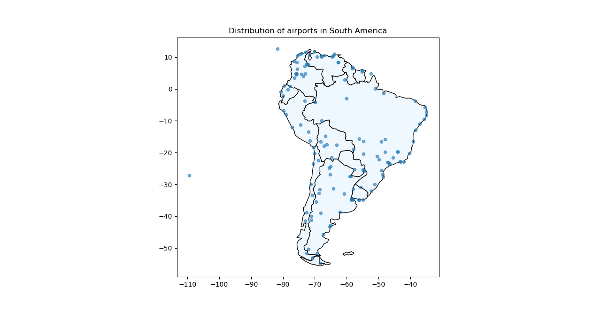
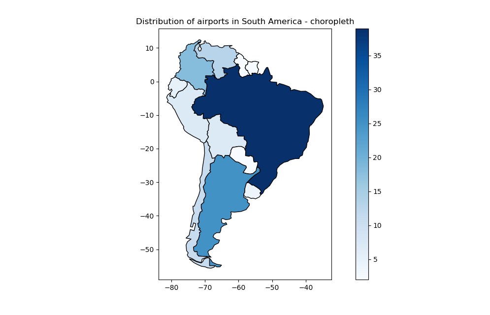
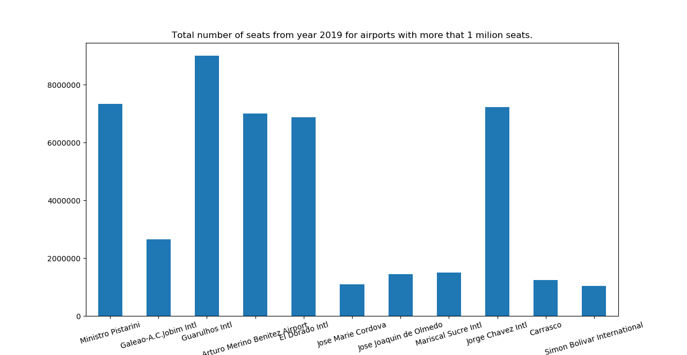

# South America Airports Visualization
## Introduction and description
This project was created for basics of programming class. It involves the analysis and visualization of data about airports from around the world. The data has been properly cleaned to only contain informations about South America airports. Using **geopandas** , a DataFrame has been changed to a GeoDataFrame to transform Longitude and Latitude into a list of objects and set it as geometry and for visualization purpose. Additionally, using the **for** loop, airports with more than 1 million seats were created, and a graph was created showing these airports. The last element of the work was creating a simple function **availability()** checking if the airport entered by the user is in the database.

## Airports Visualization:

## Plotting the coordinates over a country-level map:

## Choropleth map:

## Bar chart showing airports with the most seats:


## availability() fucntion and examples of usage:
```python
def availability(airport):
    if airport in b_dict:
        print("Informations about airport", airport, "are available in this dataset")
    else:
        print("Informations about airport", airport, "are not available in this dataset")

availability('El Dorado Intl') 
availability('Antonio Jose de Sucre') 
availability('Modlin')
```
## Output:

```
Informations about airport El Dorado Intl are available in this dataset
Informations about airport Antonio Jose de Sucre are available in this dataset
Informations about airport Modlin are not available in this dataset
```
