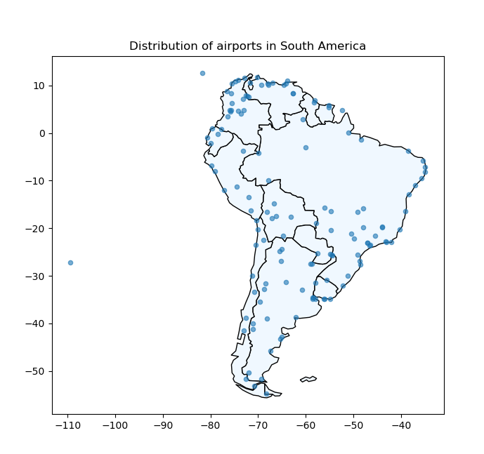
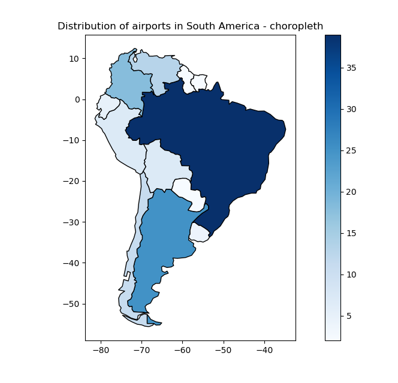

# Lotniska Ameryki Południowej
## Krótki opis projektu
Projekt powstał jako zaliczenie laboratiorów podstawy programowania. Polega na analizie i wizualizacji danych dotyczących lotnisk z całego świata. Dane zostały odpowiednio wyczyszczone tak, aby zawierały jednynie lotniska dla Ameryki Południowej. Używając **geopandas**, ramka danych została zmieniona na georamkę danych w celu nadania geometrii i wizualizacji. Dodatkowo, używając **pętli for** wydzielono lotniska, które posiadały liczbę miejsc większą niż 1 milion oraz stworzono wykres przedstawiający te lotniska. Ostatnim elementem pracy było **stworzenie prostej funkcji** sprawdzającej, czy wpisane przez użytkownika lotnisko znajduje się w bazie danych. 

## Zamiania DF na GDF i wizualizacja lotnisk:

## Merge dwóch map - wizualizacja lotnisk na tle kontynentu:

## Kartogram przedstawiający ilość lotnisk:

## Wykres słupkowy przedstawiający lotniska wykonujące najwięcej lotów:


## Funkcja sprawdzająca oraz przykłady:
```
def availability(airport):
    if airport in b_dict:
        print("Informations about airport", airport, "are available in this dataset")
    else:
        print("Informations about airport", airport, "are not available in this dataset")

availability('El Dorado Intl') 
availability('Antonio Jose de Sucre') 
availability('Modlin')
```
## Output:

```
Informations about airport El Dorado Intl are available in this dataset
Informations about airport Antonio Jose de Sucre are available in this dataset
Informations about airport Modlin are not available in this dataset
```
